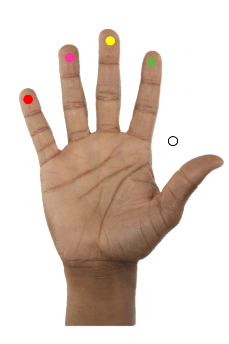
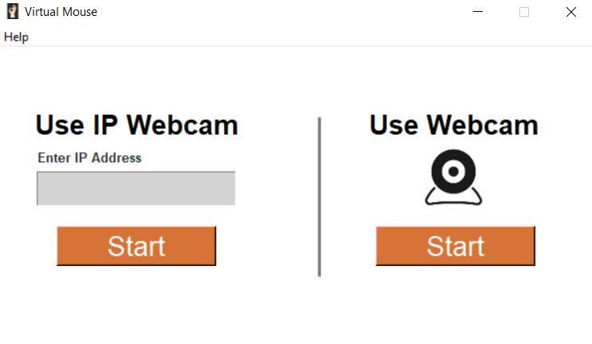
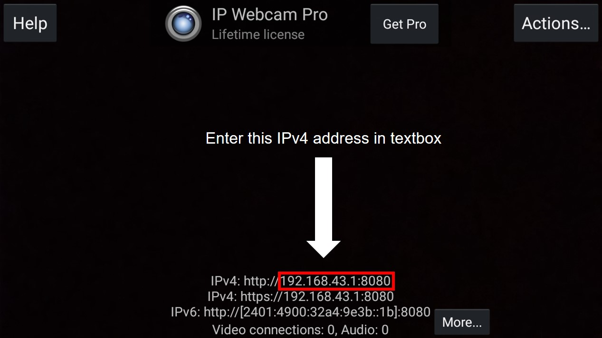

# Virtual Mouse
<a href="http://www.freepik.com"></a>
Virtual Mouse is a program that enables user to simulate Mouse operations such as Click, Double Click, Scroll Down, Scroll Up using Hand(Marker Less).

## Table of content
- [Prerequisite](#Prerequisite)
- [Installation](#Installation)
    - [OpenCV](#OpenCV)
    - [Numpy](#Numpy)
    - [MediaPipe](#MediaPipe)
    - [Pynput](#Pynput)
    - [IP Webcam](#IP-Webcam)
- [How To Use Non GUI](#How-To-Use-Non-GUI)
- [Controls](#Controls)
- [GUI Design](#GUI-Design)
- [Features](#Features)
- [References](#References)

  
       
   


## Prerequisite
The program was completely written using Python 3.7.0 in association with several other libraries such as OpenCV and Numpy for image processing, Google's MediaPipe library for human hand pose estimation. This program also utilizes IP Webcam Android Application for image acquisition which is freely availabale on Play Store.
> **_NOTE:_**  If the resolution and quality of builtin Webcam is good enough then there is no necessity of IP Webcam Application
>

## Installation
> **_NOTE:_**  Ensure that pip is properly installed and Python 3.7 is added to PATH
### OpenCV
This library is used for Image Processing and image acquisition.
> **_NOTE:_**  This application was developed without using OpenCV with CUDA GPU Support.
```
$ pip install opencv-python
```
### Numpy
Numpy is neccessary not only because it is dependencies of OpenCV but it is also used in image aquisition from IP Webcam and decode it into suitable format for further image processing operations.
```
$ pip install numpy
```
### MediaPipe
The sole purpose of MediaPipe is to detect palm and it's associated 20 landmarks on palm.
```
$ pip install mediapipe
```
### Pynput
Pynput is used to simulate mouse operations.
```
$ pip install pynput
```
### IP Webcam

<p>IP Webcam(Developed By: Pavel Khlebovich) available freely at Play Store.</p>

## How To Use Non GUI
To clone and run this application, you'll need [Git](https://git-scm.com) installed on your computer. From your command line:
```bash
# Clone this repository
$ git clone https://github.com/Ashvin-G/Virtual-Mouse.git
```
### Using IP Webcam for image acquisition
Step 1: Run the IP Webcam Application and scroll down to very bottom and "Start server".<br>
Step 2: Ensure that the Mobile and Laptop/PC are on the same network. I would recommend USB tethering.<br>
Step 3: Note down the IPv4 address generated by the IP Webcam.<br>
Step 4: Edit main.py and replace<br>
```
url = "Enter your URL here/shot.jpg"
```
with your IPv4 address.<br>
For example
```
url = http://100.73.6.196:8080/shot.jpg
```
Step 5: Run the python script.


## Controls

🔴 Scroll Down
🟣 Scroll Up
🟡 Double Click
🟢 Click
⚪ Mouse Position<br>
The ⚪ will help in moving the cursor. To perform any Mouse operation move your thumb to corresponding finger tips.

## GUI Design
<p> This is the landing window</p>

<p> This is the help window</p>



## Features
| Features  | Availability |
| ------------- | ------------- |
| Click  | :heavy_check_mark:  |
| Double Click  | :heavy_check_mark:  |
| Scroll Down  | :heavy_check_mark:  |
| Scroll Up  | :heavy_check_mark:  |
| Hold and Drag  | :x: |
| Scroll Left  | :x:  |
| Scroll Right | :x:  |

## References
[MediaPipe](https://google.github.io/mediapipe/solutions/hands.html)
[Mouse Simulation using Pynput](https://pythonhosted.org/pynput/mouse.html)
[How Build and Install OpenCV with CUDA GPU Support](https://www.youtube.com/watch?v=YsmhKar8oOc)


:star: Star me on GitHub — it motivates me a lot!


